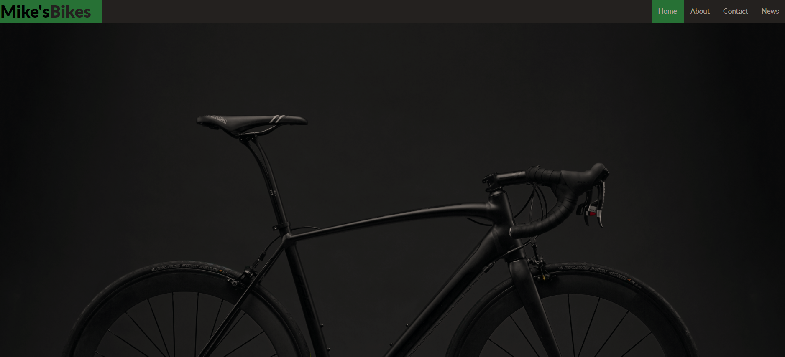

## Cookies Modal

 

 

  

 

## Summary

This is a simple modal I created to replicate the standard cookies pop-up that you get on sites that use cookies for user experience. It appears on page load and the modal will close on button press. This is one of a few modal related mini projects that I've been using to get practice in between portfolio projects to keep sharp with the basics.

**Author**
 
**Robin Fussell** _- Software Developer_ | [LinkedIn](https://www.linkedin.com/in/robin-fussell17/)