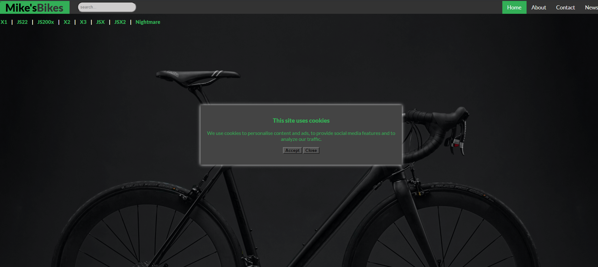

## Cookies Modal

## Summary

This is a simple site I created to replicate the standard cookies pop-up that you get on sites that use cookies for user experience, a search box that can filter result displayed, as well as a second modal with a image slider.

 

 The cookies modal appears on page load and will close on button press. 

 

 

 

 

After the first modal has been closed, the user can see the bike models in the top corner. The search box can be used to refine the list. If one of the models doesn't contain any of the characters typed, they will be removed from the list. 

 

 

The user can also view the bike models via the "2020 models" button in the center of the page, this appears after the cookies modal has been exited. The button triggers a second modal that lets the user cycle through images. This modal can also be closed by button click.

 

 

 

 

 

This is one of a few modal related mini projects that I've been using to get practice in between portfolio projects to keep sharp with the basics.

**Author**
 
**Robin Fussell** _- Software Developer_ | [LinkedIn](https://www.linkedin.com/in/robin-fussell17/)